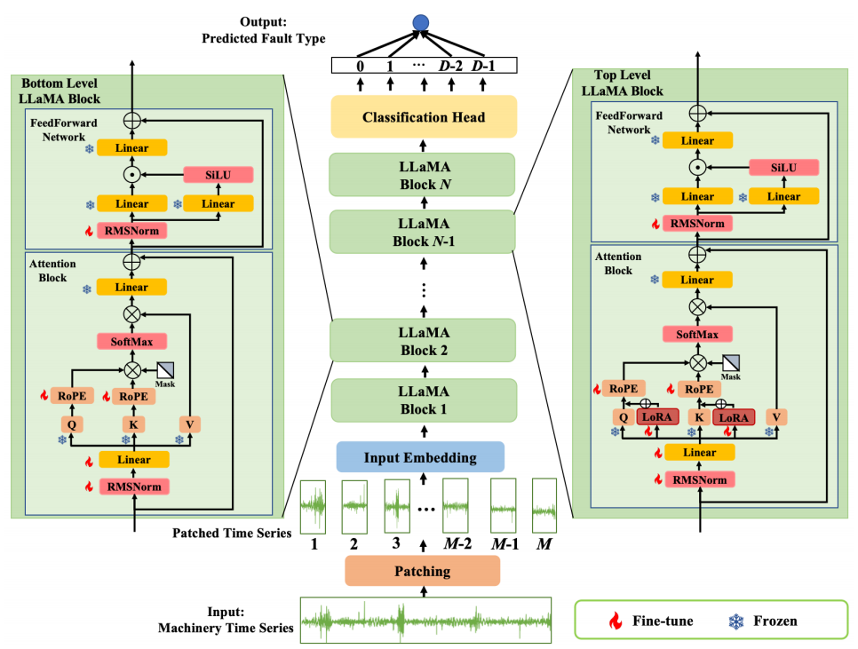

    

        
    

    

        

            <strong>H. Zhang</strong>, T. Li*, A. Jing, S. Yang
        

        

            Sequence-Spectrogram Fusion Network for Wind Turbine Diagnosis through Few-Shot Time-Series Classification
        

        

            <strong><a href="" target="_blank">Advanced Engineering Informatics</a></strong>, 2025
        

        

            [<a href="https://link-to-paper.com" target="_blank">Paper</a>]
            [<a href="https://github.com/TedZhangHao/Few-shot-Time-series-Classification" target="_blank">Code</a>]
        

    

    

        
    

    

        

            Z. Pang, <strong>H. Zhang</strong>, T. Li*
        

        

            Hybrid Fine-Tuning in Large Language Model Learning for Machinery Fault Diagnosis
        

        

            <strong>22nd IEEE International Conference on Industrial Informatics</strong>
            (<strong><a href="https://indin2024.ieee-ies.org/" target="_blank">INDIN</a></strong>), 2024
        

        

            [<a href="https://ieeexplore.ieee.org/abstract/document/10774330" target="_blank">Paper</a>]
        

    

    

        
    

    

        

            B. Yang, G. Yang, K. Yang, <strong>H. Zhang</strong>, T. Li*
        

        

            Hierarchical Informative Path Planning for Active Sensing and Field Reconstruction
        

        

            <strong>3rd International Symposium on Control Engineering and Robotics</strong>
            (<strong><a href="https://www.is-cer.org/index.html" target="_blank">ISCER</a></strong>), 2024
        

        

            [<a href="https://dl.acm.org/doi/abs/10.1145/3679409.3679463" target="_blank">Paper</a>]
        

    

    

        
    

    

        

            <strong>H. Zhang</strong>, Z. Pang, J. Wang, T. Li*
        

        

            Few-Shot Learning Using Data Augmentation and Time-Frequency Transformation for Time Series Classification
        

        

            <strong>5th International Conference on Robotics, Intelligent Control and Artificial Intelligence</strong>
            (<strong><a href="https://ic-ricai.org/" target="_blank">RICAI</a></strong>), 2023
        

        

            [<a href="https://ieeexplore.ieee.org/abstract/document/10489648" target="_blank">Paper</a>]
        

    

